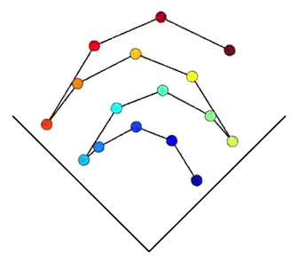

# M5Core2-SoundBouncer

## What is it?

An implementation of [Project JDM](https://www.youtube.com/channel/UCHAiieQmQBS38_AUkPf-7iQ)'s [tempo phasing demo using 16 metronomes](https://www.youtube.com/watch?v=MH03ZJaNe8A).

## Hardware requirement:

  - M5Core2

## Platform compatibility:

  - Plaformio
  - Arduino

## Libraries dependencies:

  - https://github.com/M5Stack/M5GFX
  - https://github.com/M5Stack/M5Unified
  - https://github.com/marcel-licence/ML_SynthTools
  - https://github.com/tobozo/M5Stack-SD-Updater (optional)

## Credits:

  - [Project JDM](https://www.instagram.com/project.jdm/) for providing inspiration.
  - [@warayo](https://github.com/wararyo) for sharing the [M5Stack_Core2_Sampler](https://github.com/wararyo/M5Stack_Core2_Sampler) codebase.
  - [@lovyan03](https://github.com/lovyan03) for maintaining M5Unified and M5GFX.
  - [@m5stack](https://github.com/m5stack) for creating awesome products to play with.

This project was heavily inspired by a video from [Project JDM](https://www.instagram.com/project.jdm/):

  - [Project JDM Youtube Channel](https://www.youtube.com/channel/UCHAiieQmQBS38_AUkPf-7iQ)
  - [Playing 16 metronomes at the SAME time](https://www.youtube.com/watch?v=MH03ZJaNe8A)
  - [Playing 25 metronomes at the SAME time](https://www.youtube.com/watch?v=KuQKXHKAUw4)
  - [Playing 25 metronomes IRL](https://www.youtube.com/watch?v=YhMiuzyU1ag)

## Custom tones

The current tone was generated with [SoX](http://sox.sourceforge.net):

    sox -V -r 44100 -n -b 16 -c 1 blip.wav synth 1 sin 500 vol -8dB

The sound data was produced from the wav file using `xxd` utility:

    xxd -i blip.wav > blip.h

It is later adressed as a 16bit signed array with an offset of 44 bytes:

    .sample      = (int16_t*)&blip[44],
    .length      = (blip_len-PCM_HEADER_SIZE)/2,

## Roadmap

  - ~~Generate tones from ML_Oscillator instead of using piano sample~~
  - Add controls for bounces, bullets, colors, etc
